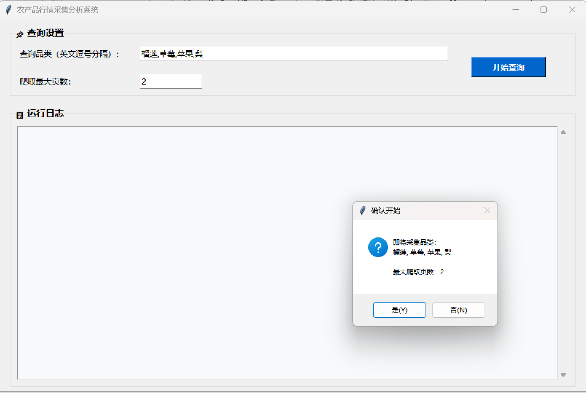
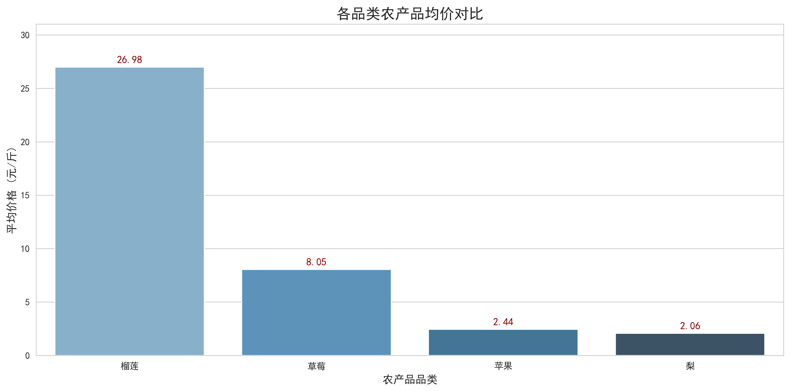
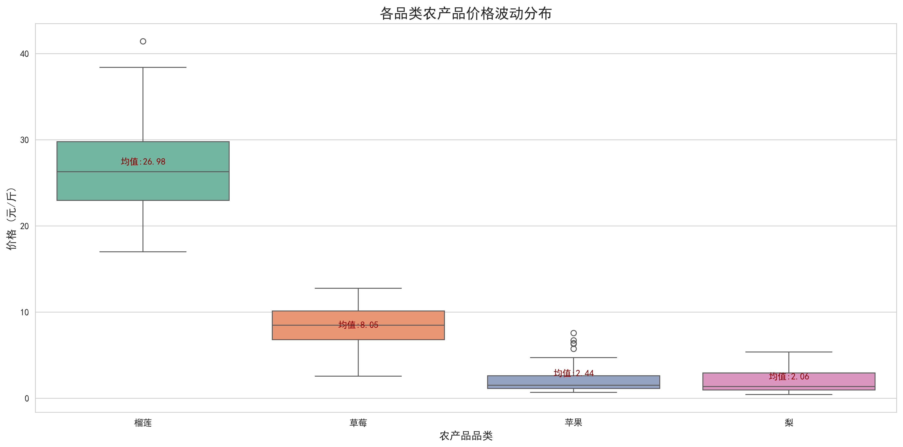

# 农产品行情数据采集与分析系统
本项目为课程设计练手项目，整合爬虫、数据清洗、数据库存储与可视化相关知识，搭建简易数据采集分析完整流程，适合 Python 入门练习。

## 📸 运行效果展示
### GUI客户端主界面


### 可视化分析图表
- 多品类农产品均价对比

- 品类价格波动箱线图（异常价格检测）

- 搜索结果‑产品名称词云


> 完整生成图表、Excel报表、原始数据文件存放于本地运行目录 `assets/output`，属于程序运行产物，未上传至仓库。

## 技术栈
Python、Playwright、Pandas、NumPy、MongoDB、Tkinter、Matplotlib、Seaborn、Openpyxl、Pytest、python-dotenv

## 项目功能
### 动态网页数据采集
基于Playwright模拟浏览器抓取惠农网农产品行情数据。配置UA池、随机访问间隔、跨品类冷却延时以及异常重试机制，降低IP被封禁风险；程序可自动识别登录弹窗、空数据、搜索失效等场景。

### 数据预处理清洗
利用Pandas完成数据去重、缺失值填充、价格格式转换；采用**3σ准则按品类过滤价格异常值**，自动划分价格区间，统一标准化业务字段。

### 数据持久化
原始数据与清洗后数据统一存入MongoDB；封装数据库操作模块，支持批量写入、全量与条件查询。

### 多维度统计分析
自动计算品类均价、中位数、标准差、变异系数、产地分布情况；统计各省份品类均价TOP5，输出行情汇总指标。

### 可视化绘图
批量生成多种分析图表：品类均价柱状图、价格区间饼图、价格箱线图、产品均价对比图、价格分布直方图、商品名称词云。

### Excel 智能分析报告
自动生成多Sheet格式化Excel文档，包含原始明细、统计指标，并嵌入可视化图片；文件名附带时间戳，避免文件覆盖。

### 桌面GUI可视化客户端
使用Tkinter开发图形界面，支持自定义采集品类、设置爬取页数；实时打印运行日志，一键启动整套采集分析流程。

### 单元测试 & 集成测试
基于Pytest搭建测试框架，使用独立Mongo测试库隔离正式业务数据，防止测试污染生产数据，验证数据清洗、入库、统计分析整条链路稳定性。

## 项目目录结构
```
agri_price_spider/
├── assets/
│   └── output/                # CSV、Excel、图片、运行日志输出目录
├── core/
│   ├── spider.py              # Playwright爬虫核心
│   ├── database.py            # MongoDB数据库操作封装
│   ├── analysis.py            # 数据清洗、统计分析函数
│   ├── visualizer.py          # Matplotlib可视化绘图
│   ├── excel_report.py        # 格式化Excel报表生成
│   └── gui.py                 # Tkinter桌面客户端
├── config/
│   ├── settings.py            # 全局配置、日志、常量、环境变量读取
│   └── selectors.py           # 页面选择器配置（网站改版只需改这里）
├── pipeline.py                # 核心流程编排（爬取→清洗→分析→报告）
├── tests/
│   ├── conftest.py            # Pytest全局夹具、测试Mongo库
│   ├── test_data_tools.py     # 工具函数单元测试
│   ├── test_analysis_business.py  # 异常值过滤、统计准确性测试
│   ├── test_pipeline.py       # 流程容错测试
│   └── test_integration.py    # 数据库集成测试
├── utils/
│   └── data_tools.py          # 字符串清洗、省份提取工具函数
├── main.py                    # 程序入口，启动GUI
├── requirements.txt           # 依赖列表
├── .gitignore
├── .env                       # 环境变量（Mongo连接、Cookie等敏感信息）
└── README.md
```

## 环境部署
### 1. 安装依赖
```bash
pip install pandas playwright pymongo pytest python-dotenv openpyxl matplotlib seaborn wordcloud jieba
playwright install chromium
```

### 2. 环境配置
新建 `.env` 配置文件
```env
MONGO_URI=mongodb://localhost:27017
LOGIN_COOKIE=你的网站Cookie字符串
```

### 3. 启动 MongoDB
本地启动MongoDB服务，默认使用27017端口。

### 4. 运行项目
```bash
python main.py
```
启动GUI客户端，填写品类与爬取页数，点击开始查询即可执行完整流程。

### 5. 执行自动化测试
```bash
pytest tests/ -v
```

## 输出内容说明
所有运行产物统一输出至 `assets/output/`
- `*.csv`：爬虫采集的原始数据
- `农产品价格分析报告_时间戳.xlsx`：综合分析报表
- `*.png`：全部可视化图表
- `项目运行日志.log`：完整运行日志
> assets/output 为程序运行时自动生成目录，首次运行代码会自动创建。


## 项目亮点
1. 代码采用模块化划分，爬虫、数据处理、数据库操作功能分离，方便后续修改与拓展；敏感配置存放于.env文件，消除硬编码。
2. 完善的异常容错机制，处理网络报错、空白页面、登录拦截、分页失效等场景。
3. 使用统计学3σ方法识别异常价格，相比固定阈值过滤更加科学合理。
4. 支持离线分析：可直接读取Mongo历史数据，重复执行清洗与统计流程。
5. 全流程自动化，无需人工整理，一键输出可视化图表与标准化分析报表。
6. 区分正式数据库与测试数据库，自动化测试保障核心代码稳定。

## 后续迭代规划
项目目前为基础实现版本，后续计划基于现有代码框架，从两大方向持续拓展：
### 数据分析方向
- 增加时序价格分析、价格波动相关性分析
- 完善更多维度可视化图表
- 尝试搭建简易价格预测模型

### 数据工程方向
- 实现增量采集，避免重复抓取历史数据
- 优化数据存储结构，构建分层数据表
- 增加定时调度、日志规范化、完善异常重试策略
- 优化报表导出逻辑，丰富Excel分析指标
- 可选：接入Web服务，脱离本地GUI运行

## 注意事项
1. 项目仅用于Python爬虫与数据分析技术学习，禁止高频、大规模抓取目标网站数据。
2. 使用前需要本地启动MongoDB；若无数据库环境，可改造代码改用文件存储。
3. Windows系统运行出现中文乱码，请确保系统存在SimHei或微软雅黑字体。
